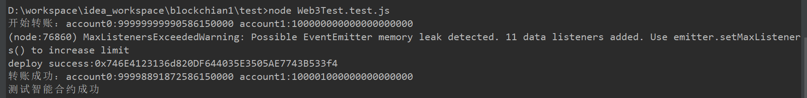
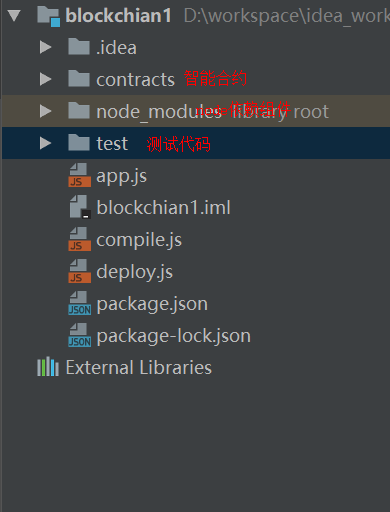
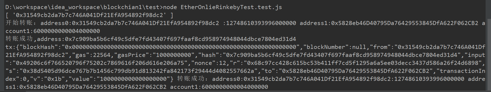

# Nodejs安装

Nodejs 版本建议8.0以上
官网：https://nodejs.org/en/
官网下载安装包:https://nodejs.org/dist/v8.12.0/node-v8.12.0-x64.msi
安装参考：https://blog.csdn.net/qq_26562641/article/details/72235585

配置淘宝镜像：
```
npm config set registry https://registry.npm.taobao.org
```

# 新建一个Hello World只能合约的访问
1. 使用IDEA安装nodejs插件，在插件列表搜索
2. 新建一个node工程项目，File>New Project 选择Node.js and NPM
 
 默认有很多其他的目录，我们删除其他目录，只保留如下的目录：
 
 或者使用`npm init`命令初始化一个nodejs工程
3.  安装solidity编译器依赖，用于编译Solidity，才能被nodejs使用到

    ```
    npm install --save solc
    ```
4. 安装以太坊的访问SDK web3.js

    ```
    npm install --save web3
    ```
    报错解决：
    > 1. 报`gyp ERR! configure error
    > gyp ERR! stack Error: Command failed: C:\Users\yan6\AppData\Local\Programs\Pytho
    > n\Python37-32\python.EXE -c import sys; print "%s.%s.%s" % sys.version_info[:3];`
    > 原因：安装脚本中用到了Python2的语法，你的环境变量中配置的Python3所以报这个错
    > 解决：修改python的环境变量，将Python3改成Python2，如果没有到官网下载一个Python2
    > 2. 报` error MSB3428: 未能加载 Visual C++ 组件“VCBuild.exe”。要解决此问题，1)`
    >   ```
    >   MSBUILD : error MSB3428: 未能加载 Visual C++ 组件“VCBuild.exe”。要解决此问题，1) 安装 .NET Framework 2.0 SDK；2) 安装 Microsoft Visual
    >   Studio 2005；或 3) 如果将
    >   该组件安装到了其他位置，请将其位置添加到系统路径中。 [D:\workspace\idea_workspace\blockchian1\node_modules\scrypt\build\binding.sln]
    >   MSBUILD : error MSB3428: 未能加载 Visual C++ 组件“VCBuild.exe”。要解决此问题，1) 安装 .NET Framework 2.0 SDK；2) 安装 Microsoft Visual
    >   Studio 2005；或 3) 如果将
    >   该组件安装到了其他位置，请将其位置添加到系统路径中。 [D:\workspace\idea_workspace\blockchian1\node_modules\scrypt\build\binding.sln]
    >   ```
    >  解决办法,按装全局windows相关组件：
    >   ```
    >   npm install --global --production windows-build-tools 
    >   ```

5. 安装ganache,ganache是用来在本地测试用的测试以太坊网络

    ```
    npm install -g ganache-cli
    ```
    
6. 新建一个Solidity脚本，`Hello.sol`

    ```
    pragma solidity ^0.4.17;
    
    contract Hello {
        string public name;
    
        function Hello(string _name) public {
            name = _name;
        }
    
        function setName(string _name) public {
            name = _name;
        }
    
        function getName() public view returns(string ) {
            return name;
        }
    }
    
    ```
7. 编写一个solidity的编译脚本compile.js

    ```
    const path = require('path');
    const  fs = require('fs');
    
    const solc = require('solc');
    
    const srcpath = path.resolve(__dirname,'contracts', 'Hello.sol');
    const source = fs.readFileSync(srcpath, 'utf-8');
    //console.log(source);
    
    const result = solc.compile(source,1);
    //console.log(result);
    module.exports = result.contracts[':Hello'];
    ```
8. 在tests下新建一个本地Hello World测试类,`Web3Test.test.js`
   
    ```
    const  assert = require('assert');
    //约定规范，如果变量是大写
    const Web3 = require('web3');
    //内存里面的以太坊测试环境
    const  ganache = require('ganache-cli');
    const web3 = new Web3(ganache.provider());
    
    //执行编译脚本，并将编译结果引入进来
    const {interface,bytecode} = require('../compile');
    
    /**
     * 测试一个Hello World智能合约
     * @returns {Promise.<void>}
     */
    testGetSet = async ()=> {
        let accounts = await web3.eth.getAccounts();
        //部署也是一个交易命令，所以需要花gas
        const abi = JSON.parse(interface);
        const contract = new web3.eth.Contract(abi);
    
        const result = await contract.deploy({
            data:bytecode,
            arguments:['Hello World']
        }).send({
            from:accounts[0],
            gas: 1500000,
            gasPrice: '30000'
        });
        console.log('deploy success:' + result.options.address);
    
        //测试查询
        assert.equal(await result.methods.getName().call(),'Hello World');
    
        await result.methods.setName('hahaha').send({
            from:accounts[0],
            gas:100000
        });
        assert.equal(await result.methods.getName().call(),'hahaha');
        console.log('测试智能合约成功');
    }
    
    
    /**
     * 测试以太坊转账
     * @returns {Promise.<void>}
     */
    testTrade = async ()=> {
        let accounts = await web3.eth.getAccounts();
        let b0 = await web3.eth.getBalance(accounts[0]);
        let b1 = await web3.eth.getBalance(accounts[1]);
        //发送交易
        console.log('开始转账：account0:' + b0 + ' account1:' + b1);
        await web3.eth.sendTransaction({
            from:accounts[0],
            to:accounts[1],
            value:'1000000000000000'
        });
    
        b0 = await web3.eth.getBalance(accounts[0]);
        b1 = await web3.eth.getBalance(accounts[1]);
        //发送交易
        console.log('转账成功：account0:' + b0 + ' account1:' + b1);
    }
    
    testGetSet();
    testTrade();
    
    ```
> 以上代码`
> const {interface,bytecode} = require('../compile');`
> 这句话的意思是将Hello.sol编译后的导入到当前的node上下文，interface就是编译后的一些方法定义，bytecode就是最终部署到以太坊网络的二进制数据

9. 测试运行
    ```
    node `Web3Test.test.js
    ```
    运行结果：
    

# 将代码提交到以太坊rankeby测试网络
1. 安装truffle-hdwallet-provider
   组件官方文档：https://www.npmjs.com/package/truffle-hdwallet-provider
    ```
     npm install truffle-hdwallet-provider
    ```
2. 使用truffle-hdwallet-provider：
    ```
    //线上的测试环境
    var HDWalletProvider = require("truffle-hdwallet-provider");
    var mnemonic = "这里是你的以太坊钱包私钥助记词"; // 12 word mnemonic
    //使用infura在线的provider
    var provider = new HDWalletProvider(mnemonic, "https://rinkeby.infura.io/v3/02b9371103e54ed6bb4ccb91651497f5");
    const web3 = new Web3(provider);
    ```
    > 上面用到的provider_url：https://rinkeby.infura.io/v3/02b9371103e54ed6bb4ccb91651497f5是infura的在线url,到https://rinkeby.infura.io注册一个账号并添加一个rinkeby的测试PROJECT就可以得到一个测试provider_url了，网络不好可能需要翻墙

3. 新增一个测试代码进行测试交易,`EtherOnlieRinkebyTest.test.js`
    ```
    //约定规范，如果变量是大写
    const Web3 = require('web3');
    
    //线上的测试环境
    var HDWalletProvider = require("truffle-hdwallet-provider");
    var mnemonic = "这里是你的以太坊钱包私钥助记词"; // 12 word mnemonic
    //使用infura在线的provider
    var provider = new HDWalletProvider(mnemonic, "https://rinkeby.infura.io/v3/02b9371103e54ed6bb4ccb91651497f5");
    const web3 = new Web3(provider);
    
    /**
     * 测试web3
     */
    testSend = async ()=> {
    
            let accounts = await web3.eth.getAccounts();
    
            console.log(accounts);
            let account0 = accounts[0];
            let account1 = '0x5828eb46D40795Da76429553845DfA622F062CB2';
    
            let b0 = await web3.eth.getBalance(account0);
            let b1 = await web3.eth.getBalance(account1);
            console.log('开始转账：address0:' + account0 + ' :' + b0 + ' address1:'+account1 + ' account1:' + b1);
            const tx = web3.eth.sendTransaction({
                from:account0,
                to:account1,
                value: web3.utils.toWei('1', 'ether'),
                data: web3.utils.toHex('I love you ,xiao man ju')
            },async (err,address)=>  {
                console.log("转账成功,address:" + address);
                b0 = await web3.eth.getBalance(account0);
                b1 = await web3.eth.getBalance(account1);
    
                let tx = await web3.eth.getTransaction(address);
                console.log('tx:'+ JSON.stringify(tx) +' 转账成功：address0:'+account0+':' + b0 + ' address1:'+account1+' account1:' + b1);
            });
           }
    
    testSend();
    
    ```

4. 使用nodejs运行测试代码
    ```
    node EtherOnlieRinkebyTest.test.js
    ```
    输出结果如下：
    

到此从开发到上传到访问以太坊rinkeby测试网络已经完成。


# Nodejs测试框架
上面我们测试一个node脚本是直接使用node命令直接运行，对于实际开发应用中如果想做到自动化测试用例的运行，需要用到类型java里面Junit测试框架的东西，这个东西在node里面叫Mocha

1. 安装mocha
    ```
    npm install --save mocha
    ```
2. 修改`package.json`，将scripts.test改成`mocha`

    ```
    {
      "name": "blockchian1",
      "version": "1.0.0",
      "description": "",
      "main": "app.js",
      "directories": {
        "test": "test"
      },
      "dependencies": {
        "mocha": "^5.2.0",
        "solc": "^0.4.25"
      },
      "devDependencies": {},
      "scripts": {
        "test": "mocha"
      },
      "author": "",
      "license": "ISC"
    }
    ```
    > 配置了scripts.test 为mocha命令，`npm run test`访问的就是mocha的测框架
3. mocha测试，`MochaTest.test.js`, describe就是基本的mocha测试骨架，it是测试用例

    ```
    const assert = require('assert');
    /**
     * ecs6 mocha测试
     */
    class Test {
        say() {
            return 'hello';
        }
    
        happy() {
            return 'haha';
        }
    }
    
    //开始写mocha测试框架
    
    let dog;
    beforeEach(()=>{
        dog = new Test();
    })
    
    describe('第一个mocha测试用例',()=> {
        it('测试hello()',()=>{
            //const  dog = new Test();
            let say = dog.say();
            console.log(say);
            assert.equal(say,'hello');
    
        })
    
        it('测试happy()',()=>{
            let happy = dog.happy();
            console.log(happy);
            assert.equal(happy,'haha');
        })
    })
    ```
> 以上用到了assert组件，这个类似java里面的Assert断言，默认在node上下文已将安装，直接依赖使用即可

4. 运行测试用例
    ```
    npm run test
    ```
    这个test访问的就是我们之前修改的`package.json`里面的test命令mocha，类似maven构建时的测试，它将运行项目上下文中的所有实现了mocha的测试用例