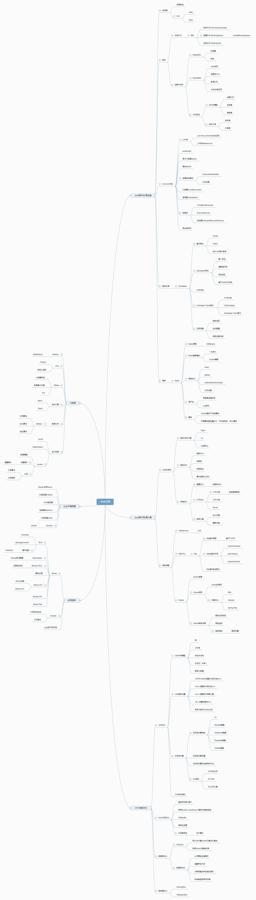

任何学习都要有目标有规划，这是整个Java知识体系大纲，根据自己的知识体系认知画出来的，有很多还没有细化，也还有很多没有涉猎，比如大数据，列出这些好让自己学的有目标一些吧，也算是一个总结。

在线预览地址：[http://naotu.baidu.com/file/a94181bfafe64d39874b524ce8df18c1?token=a8efb35e029a526f](http://naotu.baidu.com/file/a94181bfafe64d39874b524ce8df18c1?token=a8efb35e029a526f)

来自网络的架构师大纲图：

----------
[Java架构VIP课程大纲5.1.png](https://leanote.com/api/file/getAttach?fileId=5d2c29a6ab64416644002311)