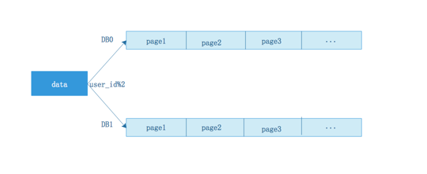
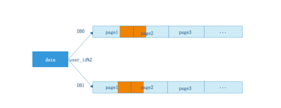
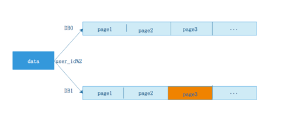
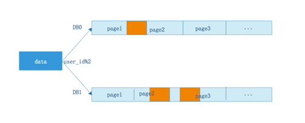
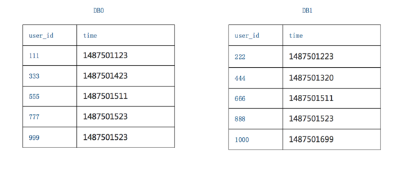
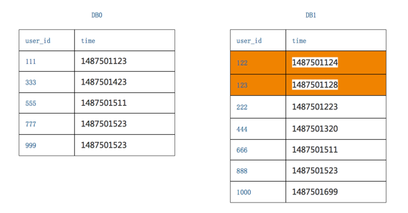
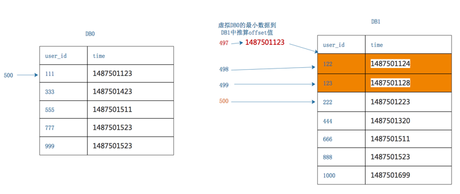
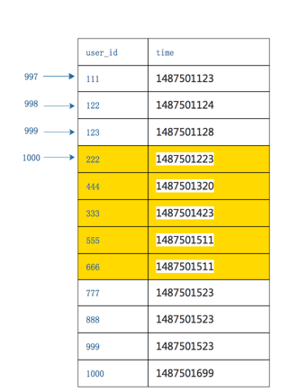

# 问题的提出

我们知道，当我们的数据量达到一定数量时，需要将数据表进行水平拆分，从而满足大量数据的存储和查询，保证系统的可用性，但同时会出现另外一个问题就是，如果业务要查询“最近注册的第3页用户”，该如何实现呢？单库上，可以通过简单的sql实现分页查询
```
select * from t_user order by time limit 200,100
```

分库分表后变成两个库后，分库依据是user_id，排序依据是time，单个分数据库层失去了time排序的全局视野，如果同样需要实现分页查询时该怎么办呢？

# 全局视野法


正常来讲，不管哪一个分库的第3页都不一定有全局第3页的所有数据，例如一下三种情况：

情况一：两个分库按照时间排序，数据各占一半，则每页取offset和limit的一般数据回来合并就可以了

情况二：所有数据都在一个库上，则取一个库的所有数据回来就可以了

情况三，那么一般情况是，每个分库的数据数据是随机的，但是一定是在全局offset=600之内


由于不清楚到底是哪种情况，所以必须每个库都返回3页数据，所得到的6页数据在服务层进行内存排序，得到数据全局视野，再取第3页数据，便能够得到想要的全局分页数据。

这种方法缺点是：当查询的页数增大时，每个分库所需返回的数据也越来成倍增加，降低了查询的性能

# 业务折中
## 第一种折中的方案是
对全局视野法的一种优化，即禁用制定页数的分页查询，必须通过下一页来实现分页查询的页数跳转，并且在每次查询下一页时将上一页的最大排序字段的值带上（这里就是时间time）,这样在每个分库查询数据时待上这个条件，可以优化查询速率。

## 第二种折中的方案是
数据库分库-数据均衡原理

使用patition key进行分库，在数据量较大，数据分布足够随机的情况下，各分库所有非patition key属性，在各个分库上的数据分布，统计概率情况是一致的。

例如，在uid随机的情况下，使用uid取模分两库，db0和db1：

（1）性别属性，如果db0库上的男性用户占比70%，则db1上男性用户占比也应为70%

（2）年龄属性，如果db0库上18-28岁少女用户比例占比15%，则db1上少女用户比例也应为15%

（3）时间属性，如果db0库上每天10:00之前登录的用户占比为20%，则db1上应该是相同的统计规律


利用这一原理，要查询全局100页数据，offset 9900 limit 100改写为offset 4950 limit 50，每个分库偏移4950（一半），获取50条数据（半页），得到的数据集的并集，基本能够认为，是全局数据的offset 9900 limit 100的数据，当然，这一页数据的精度，并不是精准的。

根据实际业务经验，用户都要查询第100页网页、帖子、邮件的数据了，这一页数据的精准性损失，业务上往往是可以接受的，但此时技术方案的复杂度便大大降低了，既不需要返回更多的数据，也不需要进行服务内存排序了。

# 二次查找法

有没有一种方法既能满足业务要求，并且不需要折中，性能还高的方法呢？
接下来介绍一种“二次查找法”，不知道能不能讲的明白，我尽量吧。

为了方便举例，假设一页只有5条数据，查询第200页的SQL语句为select * from T order by time offset 1000 limit 5;

分五步：
### 1. 将`select * from T order by time offset 1000 limit 5;` 优化成`select * from T order by time offset 500 limit 5`,注意这里的500=1000/分表数量，并将这个sql下发至每个分库分表中执行，每个分库返回这个sql执行的结果。
### 2. 找到所有分库返回结果的time的最小值


第一个库，5条数据的time最小值是1487501123
第二个库，5条数据的time最小值是1487501223

故，三页数据中，time最小值来自第一个库，time_min=1487501123，这个过程只需要比较各个分库第一条数据，时间复杂度很低

### 3. 查询二次改写
第一次改写的SQL语句是select * from T order by time offset 500 limit 5

第二次要改写成一个between语句，between的起点是time_min，between的终点是原来每个分库各自返回数据的最大值：

第一个分库，第一次返回数据的最大值是1487501523
所以查询改写为select * from T order by time where time between time_min and 1487501523

第二个分库，第一次返回数据的最大值是1487501699
所以查询改写为select * from T order by time where time between time_min and 1487501699



从上面图片可以看出，DB1比第一次查出来的数据多了两行，应为查询的范围扩大了

### 4. 计算time_min这条记录在全局的offset
根据第一步查询的sql`select * from T order by time offset 500 limit` ,我们知道每个库的offset值了，将DB0中的最小time的数据虚拟到DB1中推算在DB1中的offset值=497

从而我们得知time_min这条记录在全局的offset值=500+497=997

### 5. 根据第二次查询出来的结果集，在内存中作排序，已知time_min在全局中的offset=997,那么结果集排序之后也能推算出offset=1000所在的记录，从而获得sql`select * from T order by time offset 1000 limit 5`的分页查询记录（图片黄色部分）


总结：可以精确的返回业务所需数据，每次返回的数据量都非常小，不会随着翻页增加数据的返回量。