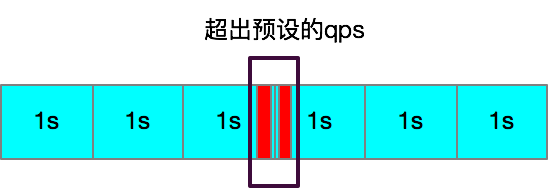
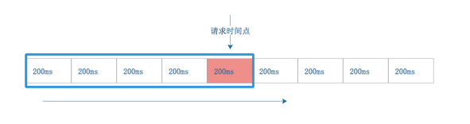
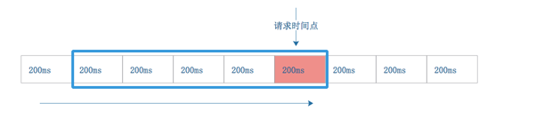
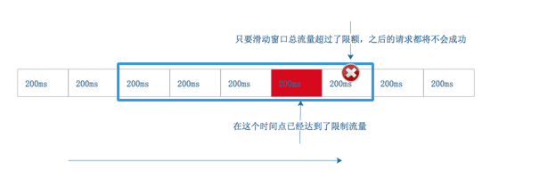
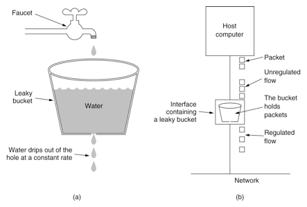
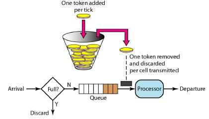

# 前言
在大流量场景，秒杀、抢购场景，一般会对网站做一些流量控制，牺牲一部分流量而保护系统而不至于系统直接down机。

# 常见限流算法
## 固定计算限流
就是统计固定时间内的流量数量，如果超过了就限制。这种很容易实现，利用AutomicLong统计，下一个统计周期后又清零重新计算。
这样会有以下问题：
1. 1s之内的前100ms就已经达到了,那么后900ms就是空闲的。
2. 如果1s之内的后100ms和下一秒的前100ms,那么在这个前后1s内加起来的流量是限流的两倍，显然这没有达到“在任意1s内流量不超过限制”的控制，很多黑客利用这个缺陷攻击网站，从而拖垮服务器。


## 滑动窗口
为了解决“计数限流”的缺陷，我们引入“滑动窗口”的计数方法。就是在计数限流的基础之上，将1个限流时间周期内切分成更小的单位计数，使得限制流量更加均分。
具体做法如下：
1. 将1s钟切成更细粒度200ms为计数单位，将请求时间点按取模的方式计算落到对应的计数格中，然后判断从当前计数格往前推1s(也就是5个计数格)的统计数总和当成当前流量的计数，如果超过阈值则限流，否则放行

2. 随着请求时间的推进，计数窗口也会随之往前移动

3. 这样的好处是，优化了“固定计数法”的缺陷，即在任意时刻，都将都以更小粒度的计数方法往前累加计算，防止在单位时间内流量超过限额。如图：


## 漏桶算法
漏桶算法思路很简单，水（请求）先进入到漏桶里，漏桶以一定的速度出水，当水流入速度过大会时，有一定的缓冲能力，超过最大缓冲时将直接拒绝。这个算法的特点就是，不管桶里面是空还是满，都以均匀的速度放行。下面是从网上找的图：



## 令牌桶算法
令牌桶算法（Token Bucket）：是网络流量整形（Traffic Shaping）和速率限制（Rate Limiting）中最常使用的一种算法。典型情况下，令牌桶算法用来控制发送到网络上的数据的数目，并允许突发数据的发送。令牌桶算法示意图如下所示：


令牌桶算法与漏桶算法的区别在于如果在一段时间内都没有流量，而桶中的令牌数有随着时间流逝匀速增加，那么桶中将会缓冲一定数量的令牌，即使后面流量突然增加超过了限额，也会由于还有可用的令牌直接放行，无需要等待。

# 限流实现
## Guava的RateLimiter实现
在Guava的工具包中，`RateLimiter`就是居于`令牌桶算法`实现的内存限流。
其构造有如下几个：
```
 //构造方法1
  @VisibleForTesting
  static RateLimiter create(SleepingTicker ticker, double permitsPerSecond) {
    //实现类是Bursty
    RateLimiter rateLimiter = new Bursty(ticker, 1.0 /* maxBurstSeconds */);
    //根据permitsPerSecond每秒令牌数计算，每个令牌产生的毫秒数
    rateLimiter.setRate(permitsPerSecond);
    return rateLimiter;
  }
  
  //构造方法2
 static RateLimiter create(
      SleepingTicker ticker, double permitsPerSecond, long warmupPeriod, TimeUnit unit) {
    //实现类是一个平滑预热限流，就是如果流量突然暴增，即使有足够的令牌，也不会一下子全部放下，会加一些线性等待时间平滑过渡
    RateLimiter rateLimiter = new WarmingUp(ticker, warmupPeriod, unit);
    rateLimiter.setRate(permitsPerSecond);
    return rateLimiter;
  }
  
```

获取令牌
```
  public double acquire(int permits) {
    checkPermits(permits);
    long microsToWait;
    //获取全局锁
    synchronized (mutex) {
        //根据当前时间算出还需要等待的时间
        microsToWait = reserveNextTicket(permits, readSafeMicros());
    }
    ticker.sleepMicrosUninterruptibly(microsToWait);
    return 1.0 * microsToWait / TimeUnit.SECONDS.toMicros(1L);
  }
```

下面是令牌桶算法的核心
```
  private long reserveNextTicket(double requiredPermits, long nowMicros) {
    //根据当前时间算出可用令牌数及要出来这么多令牌的时间点
    resync(nowMicros);
    //看下还需要等多久
    long microsToNextFreeTicket = nextFreeTicketMicros - nowMicros;
    //看下当前要立即花费多少令牌
    double storedPermitsToSpend = Math.min(requiredPermits, this.storedPermits);
    //还剩多少令牌需要等待
    double freshPermits = requiredPermits - storedPermitsToSpend;

    //根据不同的实现，Bursty或者WarmingUp，返回额外需要等待的时间
    long waitMicros = storedPermitsToWaitTime(this.storedPermits, storedPermitsToSpend)
        + (long) (freshPermits * stableIntervalMicros);

    //重置获取这么多令牌要等到啥时候
    this.nextFreeTicketMicros = nextFreeTicketMicros + waitMicros;
    //更新下还剩多少可用令牌
    this.storedPermits -= storedPermitsToSpend;
    //返回还需要等待的时间
    return microsToNextFreeTicket;
  }
```
可以看到这个实现，并不是根据算法图一个生产者不断的往一个数组中添加令牌，一个消费者不断的取令牌，而是以时间线的方式，计算出当前获取令牌需要花费的时间及算出当前时间以设定的速度能够无产生多少令牌的方式实时计算的，简单并且没有额外的轮询操作，非常高效节省资源。


## 使用Semphore进行并发流控
`Semphore` 是JUC里面的并发信号量实现，Semaphore可以控制某个资源可被同时访问的个数，通过 acquire() 获取一个许可，如果没有就等待，而 release() 释放一个许可。很适合多线程情况对有限资源的抢占控制。


## Netflix Hystrix 熔断限流
Spring Clound里的Hystrix能否实现根据一定的访问异常设置，对应用做到降级限流的的控制

## 阿里的Sentinel实现
Sentinel 是阿里中间件团队开源的，面向分布式服务架构的轻量级高可用流量控制组件，主要以流量为切入点，从流量控制、熔断降级、系统负载保护等多个维度来帮助用户保护服务的稳定性。
GITHUB:https://github.com/alibaba/Sentinel
其官方文档中也提到，其受到Guava RateLmiter的启发。

大家可能会问：Sentinel 和上面提到的Netflix Hystrix 有什么异同呢？
其官方文档有专门的说明：
https://github.com/alibaba/Sentinel/wiki/Sentinel-%E4%B8%8E-Hystrix-%E7%9A%84%E5%AF%B9%E6%AF%94


## 其他实现
进行限流控制还可以有很多种方法，针对不同的场景各有优劣，例如通过AtomicLong计数器控制、Redis计数，使用MQ消息队列进行流量消峰等等都是可以的。

# 总结
流量控制在高并发场景是一个对系统保护必不可少的一个手段，能够牺牲一部分流量而保护整个应用的可用性，不止于发生雪崩情况。