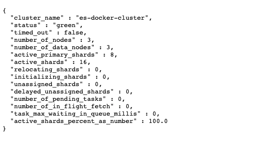

参考docker安装Elasticsearch官方文档
https://www.elastic.co/guide/en/elasticsearch/reference/current/docker.html

# 获取镜像
```
docker pull docker.elastic.co/kibana/kibana:7.16.0
```

# docker-compose启动

## 新建docker-compose.yml文件
```
version: '2.2'
services:
  es01:
    image: docker.elastic.co/elasticsearch/elasticsearch:7.16.0
    container_name: es01
    environment:
      - node.name=es01
      - cluster.name=es-docker-cluster
      - discovery.seed_hosts=es02,es03
      - cluster.initial_master_nodes=es01,es02,es03
      - bootstrap.memory_lock=true
      - "ES_JAVA_OPTS=-Xms512m -Xmx512m"
#      - http.port=9200
#      - node.master=true
#      - node.data=true
#      - node.ingest=true
    ulimits:
      memlock:
        soft: -1
        hard: -1
    volumes:
      # - /Users/yue/data/elasticsearch-cluster/es01/config/elasticsearch.yml:/usr/share/elasticsearch/elasticsearch.yml
      - /Users/yue/data/elasticsearch-cluster/es01/data:/usr/share/elasticsearch/data 
      - /Users/yue/data/elasticsearch-cluster/es01/logs:/usr/share/elasticsearch/logs
#      - /Users/yue/data/elasticsearch-cluster/elasticsearch.yml:/usr/share/elasticsearch/config/elasticsearch.yml
    ports:
      - 9200:9200
    networks:
      - elastic

  es02:
    image: docker.elastic.co/elasticsearch/elasticsearch:7.16.0
    container_name: es02
    environment:
      - node.name=es02
      - cluster.name=es-docker-cluster
      - discovery.seed_hosts=es01,es03
      - cluster.initial_master_nodes=es01,es02,es03
      - bootstrap.memory_lock=true
      - "ES_JAVA_OPTS=-Xms512m -Xmx512m"
#      - http.port=9201
#      - node.master=true
#      - node.data=true
#      - node.ingest=true
    ulimits:
      memlock:
        soft: -1
        hard: -1
    volumes:
      # - /Users/yue/data/elasticsearch-cluster/es02/config/elasticsearch.yml:/usr/share/elasticsearch/elasticsearch.yml
      - /Users/yue/data/elasticsearch-cluster/es02/data:/usr/share/elasticsearch/data 
      - /Users/yue/data/elasticsearch-cluster/es02/logs:/usr/share/elasticsearch/logs
 #     - /Users/yue/data/elasticsearch-cluster/elasticsearch.yml:/usr/share/elasticsearch/config/elasticsearch.yml
    ports:
      - 9201:9200
    networks:
      - elastic

  es03:
    image: docker.elastic.co/elasticsearch/elasticsearch:7.16.0
    container_name: es03
    environment:
      - node.name=es03
      - cluster.name=es-docker-cluster
      - discovery.seed_hosts=es01,es02
      - cluster.initial_master_nodes=es01,es02,es03
      - bootstrap.memory_lock=true
      - "ES_JAVA_OPTS=-Xms512m -Xmx512m"
#      - http.port=9202
#      - node.master=true
#      - node.data=true
#      - node.ingest=true
    ulimits:
      memlock:
        soft: -1
        hard: -1
    volumes:
      # - /Users/yue/data/elasticsearch-cluster/es03/config/elasticsearch.yml:/usr/share/elasticsearch/elasticsearch.yml
      - /Users/yue/data/elasticsearch-cluster/es03/data:/usr/share/elasticsearch/data 
      - /Users/yue/data/elasticsearch-cluster/es03/logs:/usr/share/elasticsearch/logs
#      - /Users/yue/data/elasticsearch-cluster/elasticsearch.yml:/usr/share/elasticsearch/config/elasticsearch.yml
    ports:
      - 9202:9200
    networks:
      - elastic

  kib01:
    image: docker.elastic.co/kibana/kibana:7.16.0
    container_name: kib01
    ports:
      - 5601:5601
    environment:
      ELASTICSEARCH_URL: http://es01:9200
      ELASTICSEARCH_HOSTS: '["http://es01:9200","http://es02:9200","http://es03:9200"]'
    networks:
      - elastic
  cerebro:
    image: lmenezes/cerebro:latest
    container_name: cerebro
    ports:
      - "9000:9000"
    command:
      - -Dhosts.0.host=http://es01:9200
      - -Dhosts.1.host=http://es02:9200
      - -Dhosts.2.host=http://es03:9200
    networks:
      - elastic

volumes:
  data01:
    driver: local
  data02:
    driver: local
  data03:
    driver: local

networks:
  elastic:
    driver: bridge

```

## 启动

```
docker-compose -f ./docker-compose.yml up d
```

> 有可能报错'failed to resolve host [es01] '
> This sample docker-compose.yml file uses the ES_JAVA_OPTS environment variable to manually set the heap size to 512MB. We do not recommend using ES_JAVA_OPTS in production. See Manually set the heap size.
> 解决办法，如果你用的市Mac左面版的docker,docker虚拟机内存默认是2G是不够的，调整到4G以上这个问题解决
> 

# elasticsearch运维常用api


## 查看实例健康状态
```
http://localhost:9200/_cat/health?v
```


## 查看集群健康状态
```
http://localhost:9200/_cluster/health?pretty
```


## 查询分片状态
```
http://localhost:9200/_cat/shards/test*?v
```

# Elasticsearch的console常用api
```

```


# 安装cerebro
cerebro是Elasticsearch的可视化运维工具

docker 镜像获取
```
 docker pull lmenezes/cerebro
```

启动
```
 docker run -d --name cerebro -p 9000:9000 045d7f40bf06
```

cerebro可以看到每index的分片分布情况

浏览器打开：http://localhost:9000/


# 附件
## 问题一：如果出现docker 容器假死需要强制stop时

```
停止所有的容器 docker stop $(docker ps -q)

强制移除此容器 docker rm -f mysql1

最后一招，强制重启docker服务
service 方式
重启docker服务
sudo service docker restart
关闭docker
sudo service docker stop
```
如果是Docker-Destop左面版，可以在设置中重启

## 问题二：ELK出现unassigned_shards查看及删除
ES的data节点异常关闭，会导致副本出现unassigned shard，致使索引状态变为yellow，甚至是red。

### 解决办法1：
```
# 查询所有分片数据
GET _cat/shards

# 或者查询集群健康状态
GET _cluster/health
出现unassigned_shards大于0时表示有异常分片数据
```

如果运气不好，遇到了主分片异常，上面的方法不管用，可以先用重试的方法尝试恢复
```
/_cluster/reroute?retry_failed=true
```

一般data节点异常退出，该方法都能解决。

### 解决办法2：
若不起作用，可以尝试重新分配主分片，不过可能会有部分数据丢失。

```
POST /_cluster/reroute?pretty
{
    "commands" : [ {
        "allocate_stale_primary" :
            {
              "index" : "test", 
              "shard" : 3,
              "node" : "192.168.1.1_9200",
              "accept_data_loss" : true
            }
        }
    ]
}
```

### 解决办法3：
删除问题索引

```
curl -XDELETE localhost:9200/索引名称
```


解决办法4：出现以上问题的原因除了同步异常外，还有一个原因可能是磁盘空间使用率大于85%。
es中有个配置`cluster.routing.allocation.disk.watermark.low`默认是85%，系统磁盘空间使用率大于85%将出现此问题

解决办法要么调整这个配置，要么清理磁盘
```
PUT /_cluster/settings
{
    "transient" : {
        "cluster.routing.allocation.disk.watermark.low" : "90%"
    }
}
```