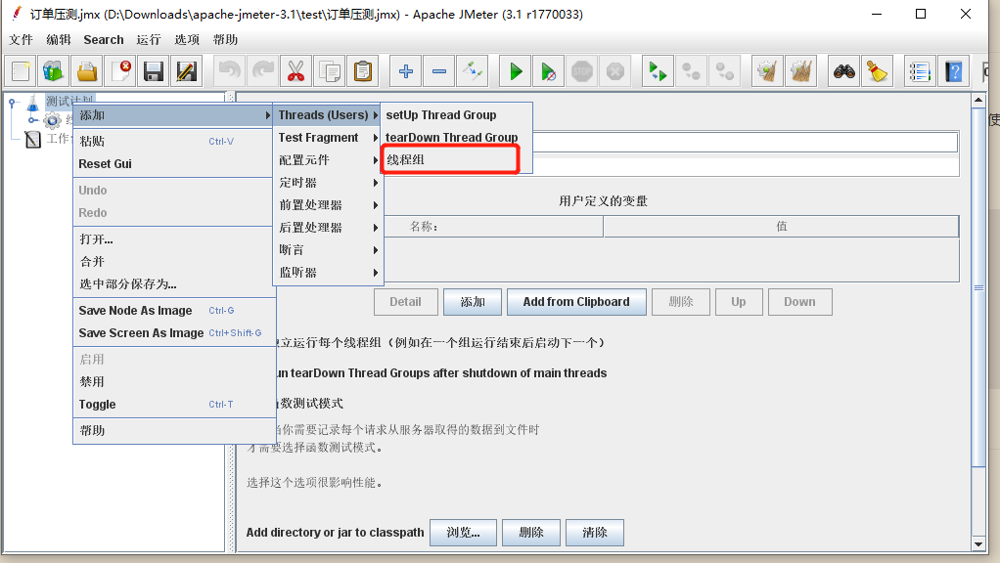
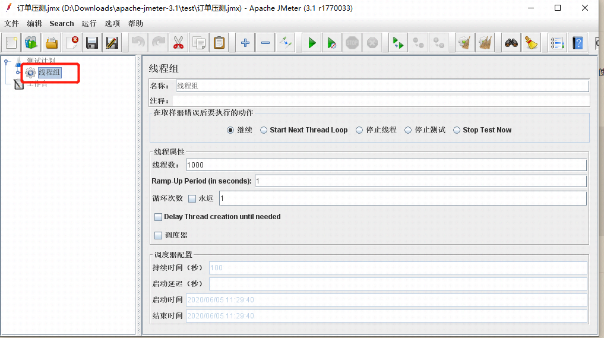
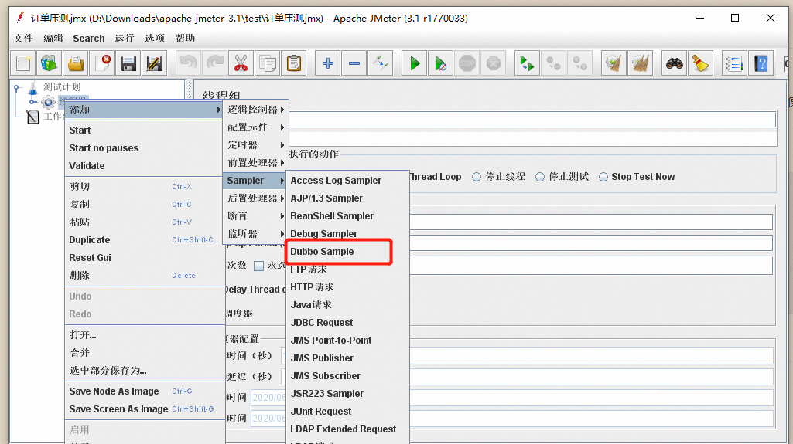
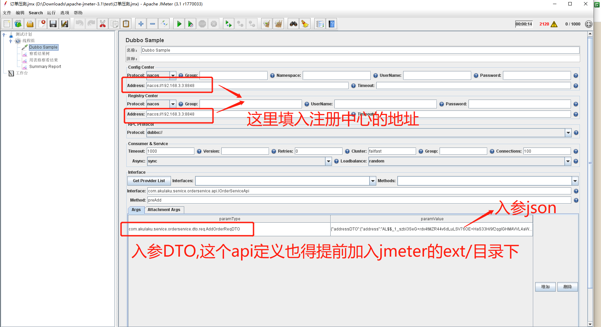
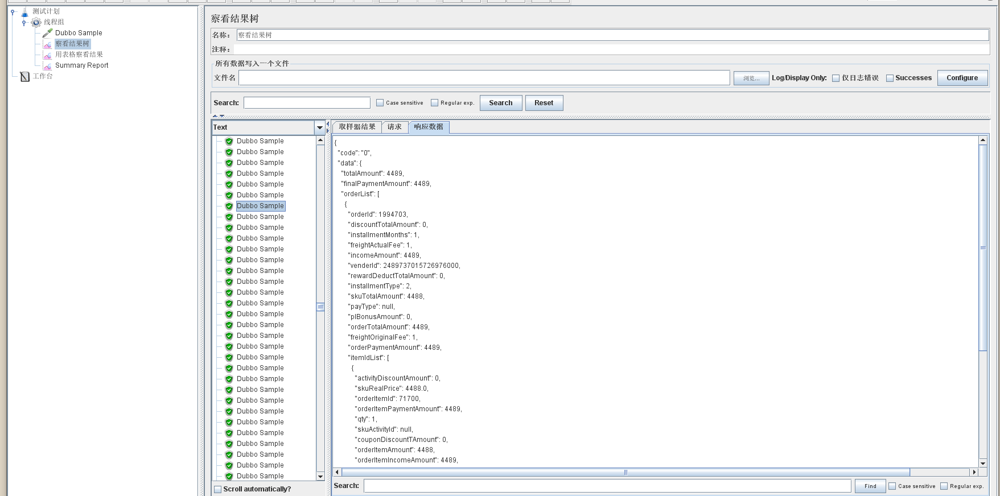
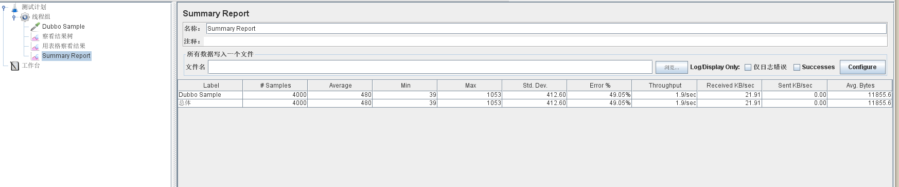
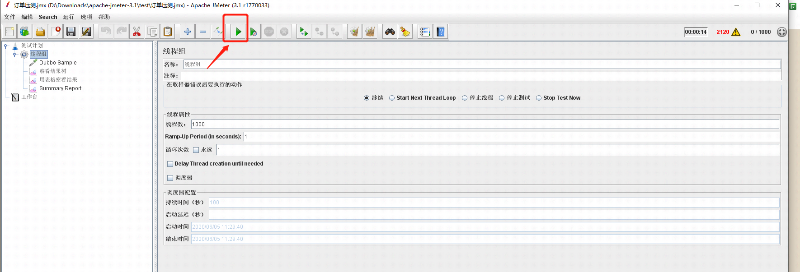
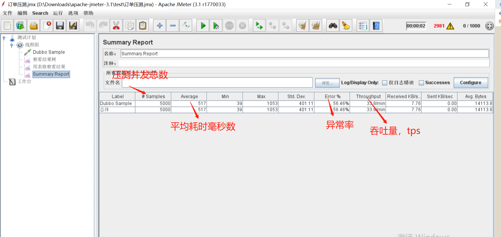
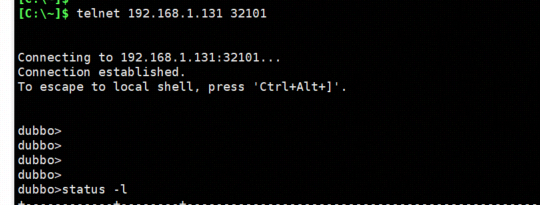
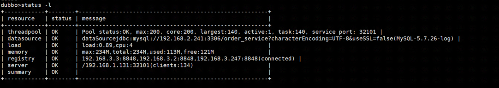

# 软件准备
## 一、下载Jmeter3.1

下载地址：https://archive.apache.org/dist/jmeter/binaries/apache-jmeter-3.1.zip
其他版本：https://archive.apache.org/dist/jmeter/binaries/

更高版本的Jmeter 5+好像有点问题，建议还是用这个版本吧

## 二、下载dubbo官方的jmeter插件

下载地址：https://gitee.com/ningyu/dist-jmeter-plugins-for-apache-dubbo/raw/master/2.7.7/jmeter-plugins-dubbo-2.7.7-jar-with-dependencies.jar
官方用户指南：https://github.com/thubbo/jmeter-plugins-for-apache-dubbo/wiki/%E7%94%A8%E6%88%B7%E6%8C%87%E5%8D%97

## 三、解压Jmeter

将jmeter-plugins-dubbo-2.7.7-jar-with-dependencies.jar放到`${JMETER_HOME}\lib\ext.`中

## 四、启动Jmeter

 `${JMETER_HOME}\jmeter.bat`

# 五、使用Jmeter进行订单接口压测

## 在测试计划中右键添加一个线程组，设置压测的线程数及并发数



## 添加一个Dubbo Simple测试任务


将被测试的dubbo api加入`${JMETER_HOME}\lib\ext.`中，否则paramType将找不到类，paramValue填入入参DTO的json对象，注意不能有格式，否则解析不出来，这是个坑


## 添加请求查看树，方便查询每个请求的出入参；线程组>添加>监听器>查看结果树


## 添加测试结果汇总报告；线程组>添加>监听器>Summary Report


## 开始压测，点击启动


## 结果查看，压测过程中可以看到请求参数，压测完之后可以压测结果，一般需要经过多次压测且压测的线程和并发数多一点



# 六、dubbo服务器状态查看

1. 使用telnet进入dubbo的console界面
```
telnet 192.168.1.131 32101
后回车
```

`status -l` 查看线程状态
