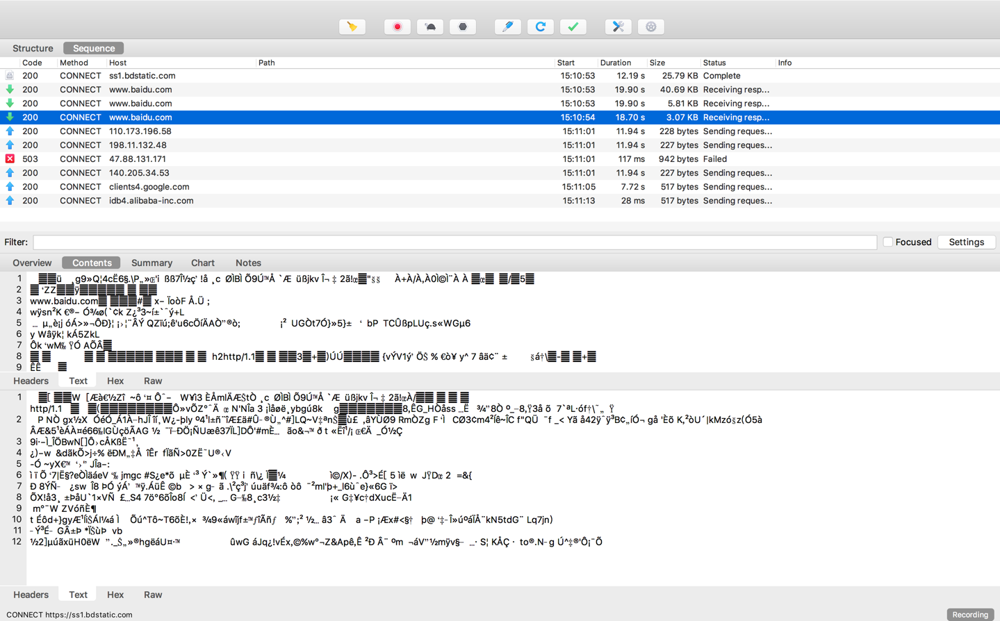

Charles是一款抓包必备的工具，支持Windows、Mac、手机的抓包测试，还能对https的SLL加密内容进行解密。

# 下载安装
1. 进入官网下载地址：http://www.charlesproxy.com/，点击链接下载30天免费试用版本。

2. 在线破解：
https://www.zzzmode.com/mytools/charles/

# 基本使用
## 电脑抓包

1. 打开Charles，默认是开启抓包代理的，可以看到电脑http请求的内容,你也可以将电脑的抓包代理给关掉，在Proxy>enable MacOs proxy 勾选去掉

2. 设置https证书代理抓包，
安装证书：

打开百度https://www.baidu.com 测试，发现全是乱码：

鼠标点击右键添加Enable SLL Proxy,从新刷新页面，Google Chrome 默认把这个当成不安全证书了，使用FireFox浏览器可以添加例外强制打开：

可以看到Charles已经将https的内容通过Charles 证书加代理的方式能够看到明文请求信息了。

# 手机抓包
1. 设置网络代理

通过上面菜单找到Charles的代理服务器IP和端口

保证你的手机和你的电脑是在同一个局域网内，打开手机的WLAN配置，ip为上图的30.117.52.174，端口为：12345

2. 如果想看到https的请求内容，还是得和电脑一样安装Charles证书，通过safari打开https://chls.pro/ssl 下载证书
手机--setting-->General--->Profiles & Device Management --->Charles Proxy CA...
将设置为信任。如图：

3. 接着就可以查看到手机上的网络请求数据了，如果是https点击右键Enable SLL Proxy，在重新刷新下就可以看到了。