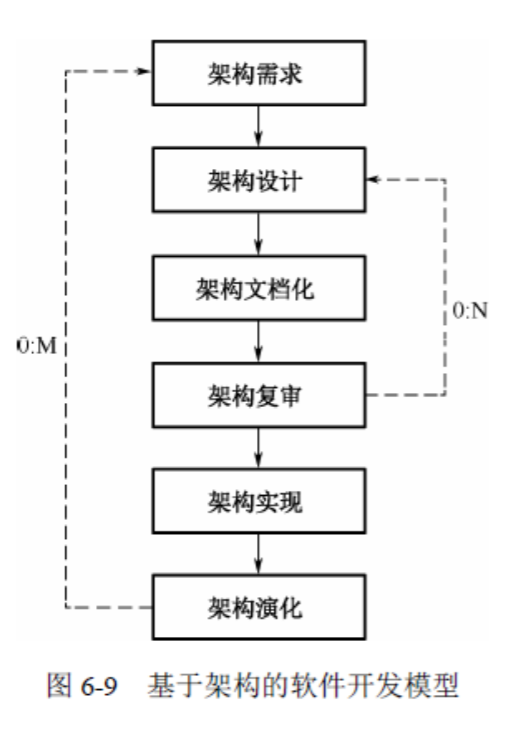

> 前言：软件开发方法是软件开发的方法学，旨在提供软件的质量，降低开发成本

# 1 软件生命周期

 1. 可行性研究和规划：通过可行性分析确认原件的必要性，价值点，初步确认软件的目标、范围、风险和开发成本等内容。
 2. 需求分析：需求分析是开发过程的重要阶段，初步确认软件开发的目标和范围，之后则要对软件的需求进行细致分析，确认最终要做成什么样子。这个过程极其重要，如果这个阶段出现分析错误和偏差将导致后续开发过程偏离真实需求越远，修正的成本越大。
 3. 概要设计：是程序员开发过程中的蓝图，包括确认系统架构、各个子系统依赖关系、数据库模型、编码规范、接口规约等内容
 4. 详细设计：详细设计师开发之前的最后设计，是在概要设计的基础上进行进行细化，如类设计。详细设计不是必要过程，在规模较小，功能结构简单的系统中可以省略。
 5. 实现：针对设计的单元模块进行开发，如一个过程、方法、函数，包括实现单元模块的单元测试
 6. 集成测试：对单元模块进行组装联调测试
 7. 确认测试：系统开发完后，需要验证是否和需求预期一致
 8. 软件使用和维护：软件投入试运行，并不断对过程中出现的问题进行维护修正，软件维护郭晨会贯穿整个软件的使用郭晨直至软件自然消亡。

# 2 软件开发模型
计算机刚刚诞生的年代，是一种只有天才才能掌握的巩固，人们对软件知识的认知仅仅停留在程序层面。随着技术发展，软件复杂度的提高，意识到必须遵循一定的开发方法才能取得成功，于是出现了模式化的开发方法称为开发模型。

## 2.1 瀑布模型

特点：
1. 软件过程要经过需求分析、总体设计、详细设计、编码、调试、集成测试和系统测试阶段，开发阶段划分明确
2. 再每一个阶段结算后都有不定的文档或者程序流入下一个阶段
3. 每个阶段在发现问题时可以反馈给上一个阶段进行修正
适用场景：需求明确、稳定时

### 2.1.1 瀑布V模型
同标准瀑布模型一样，保持了瀑布模型的阶段式文档驱动的特点，但是更强调软件产品的验证工作，即需求分析的记过将作为系统测试的标准，能够在设计初期得到验证，以此类推，总体设计对应了集成测试，详细设计对应了单元测试。

### 2.1.2 瀑布模型的缺点
1. 需求分析是一切活动的基础，如果需求分析出现偏差，将导致后续活动放大这个偏差。但事实是，由于用户、开发者立场、经验不同、知识领域不同，对同一事物的表述不同造成的理解偏差难于避免，导致后期维护工作繁重
2. 难于适应需求变化，一旦需求变更要重头再来
3. 从需求提出到最后看到产品是一个相当长的过程，不能及时给用户反馈，并验证是否是能够满足客户需求的软件。
4. 瀑布模型是面向文档的开发模型，过程中将产生大量文档，大部分对客户没有意义，但却工作量繁重

## 2.2 演化模型
演化模型是在瀑布模型难以一次性完全理解用户需求的基础上，对整个过程进行若干次的“瀑布模型”迭代，做到不断渐进、不断深入的过程

## 2.3 螺旋模型
螺旋模型是在瀑布模型和演化模型结合的基础上，还强调其他模型忽略的风险分析。
特点：
1. 螺旋模型对每一期都包含需求定义、风险分析、工程实现、和评审4个阶段，对整个过程进行螺旋式迭代
2. 支持用户需求的动态变化，为用户参与软件开发的所有关键决策提供方便，降低软件开发风险

缺点：
1. 螺旋模型的风险评估需要具有丰富风险评估经验和专业知识的人，否则将造成重大损失
2. 过多的迭代次数会增加开发成本，延迟提交时间

## 2.4 增量模型
演化模型是另外一种增量模型的形式。在系统架构成熟、风险较低时，可采用增量方式进行系统开发，可提前进行基础测试和系统测试，缩短出事版本的发布周期，提高用户对系统的可见度。
特点：
1. 增量模型，做好系统的分析和设计，对系统划分为若干不同的版本，每一个版本都是完成可用的系统，后一个版本是前一个版本的基础进行开发，扩展前一个版本的功能，同时保证每个版本增量均匀。
2. 原型法，每一次发布都经历完成的生命周期，当用户需求很多不明确或者技术架构中很多不可知因素时，可采用原型增量法。在初始版本的原型并不考虑需求的合理性和系统稳定性，只为精准获取用户需求，一般会在后面的开发中抛弃这个原型进行完成的系统实现。

## 2.5 构件组装模型

将系统划分为一组构件的集合，明确构件之间的关系。每个构件可以独立开发、自包容，可以是自己开发设计，也可以是第三方购买整合。最后进行构件组装的一个开发模型。
构件组装优点：
1. 构件自包容让系统扩展变得更加容易
2. 良好的构件更容易重用，降低开发成本
3. 构件力度较整个系统更小，更容易开发设计及安排工作更加灵活

缺点：
1. 对构件设计需要经验丰富的架构设计师，设计不良的构件难以实现他的优点
2. 考虑重用度是，往往会对其他方面设计做出让步，比如性能
3. 构件组装应用是，要求程序员熟悉掌握构件，增加了开发人员的学习成本
4. 第三方构件质量难以把控，将影响软件的质量。

# 3 统一过程模型
统一过程（Unified Process, UP）是一种优秀的软件开发模型，可以有效地降低软件开发过程中的风险。这个开发模型的特点是每一个阶段的工作都不是绝对的，都是相互交叠配的的，但是每一个阶段都有侧重点。

整个过程大致分为
1. 初始阶段，刚刚接入系统开发工作，侧重工作是明确系统目的，业务建模和需求工作
2. 细化阶段，抽象软件逻辑模型，设计架构，侧重是分析设计工作
3. 构件阶段，完成系统的构件，使之成为一个完整的实体，并进行测试和部署
4. 交付阶段，软件系统需求已经完成，重点工作是对软件进行重构、修改、测试和部署

整个工作内容整体包括：业务建模、需求、分析设计、实施、测试、部署、配置与变更管理、项目管理、环境。

其中“环境”是相对于其他工作难以理解的。环境工作很重要，也称之为环境管理。在软件开发过程中，需要为各种工作准备相应的工作环境，在工作环境中包含必须的工具、活动指南、活动流程规范、工作产品模板、基本的开发设施等。环境管理应该在工作流中得到应有的重视，每个开发团队都有自己的特点和活动准则规范，这种准则和规范是团队协作的基础，万万不能少，否则开发活动就会使放养式的管理。

** UP的生命周期**
分为4个里程碑
1. 目标里程碑。明确系统的目标和范围时达到这个里程
2. 架构里程碑。当开发者确定稳定系统的架构时达到这个里程
3. 能力里程碑。当系统已经足够稳定和成熟并完成了Alpha测试之后达到这个里程碑
4. 发布里程碑。当完成系统的测试、完成系统的发布和用户培训工作之后达到这个里程碑

UP的特点：
1. UP是一个迭代的二维开发模型，每个生命后期都可以进行需求、设计、开发等
2. 采用不同的迭代方式的UP可以演变为演化模型或增量模型
3. UP的迭代特点使得更容易控制开发风险
4. Up是迭代开发模型，但不属于敏捷开发模型。一般未经过裁剪的Up是一个重载过程
5. 实际应用可根据具体问题进行UP的裁剪，从而使用各种规模的软件和开发团队

架构师在UP活动中的作用
架构师除了需要建立系统的架构模型外，在UP活动中承担非常重要的角色，例如：
1. 同需求人员和项目管理人员密切协作
2. 细化软件架构
3. 保持整个架构的概念完整性，具体地说就是定义设计方法、设计指南、编码规范、平舌工作
**因此有人称UP是一个已加购书为中心的开发模型。**

# 4 敏捷开发方法
2001年，17位“无政府主义者”共同发表了《敏捷软件开发宣言》：
> 1. 尽早地、持续地向客户交付有价值的软件对开发人员来说是最重要的。
2. 拥抱变化，即使在开发的后期。敏捷过程能够驾驭变化，保持客户的竞争力。
3. 经常交付可工作的软件，从几周到几个月，时间范围越小越好。
4. 在整个项目中，业务人员和开发者紧密合作。
5. 围绕士气高昂的团队进行开发，为团队成员提供适宜的环境，满足他们的需要，并给予
足够的信任。
6. 在团队中，最有效率的、也是效果最好的沟通方式是面对面地交流。
7. 可以工作的软件是进度首要的度量方式。
8. 可持续地开发。投资人、开发团队和用户应该保持固定的节奏。
9. 不断追求优秀的技术和良好的设计有助于提高敏捷性。
10. 要简单，尽可能减少工作量。减少工作量的艺术是非常重要的。
11. 最好的架构、需求和设计都来自于一个自我组织的团队。
12. 团队要定期地总结如何能够更有效率，然后相应地自我调整

这份宣言就是敏捷开发方法的灯塔

## 4.1 敏捷开发方法实践之极限编程（eXtreme Programming）
极限编程（XP）是一种轻量（敏捷）、高效、低风险、柔性、可预测、科学而且充满乐趣的软件开发方法。特点如下：
1. 在更短的周期内，更早地提供具体、持续的反馈信息。
2. 迭代地进行计划编制。在最开始迅速形成总体计划，然后开发过程中不断迭代发展它
3. 依赖自动化测试程序来监控开发进度，尽早地铺货缺陷
4. 依赖口头交流、测试和源程序进行沟通
5. 倡导持续的、演化式的设计
6. 依赖于开发团队内部的紧密协作
7. 尽可能达到程序员的短期利益和长期利益的平衡。即关注短期程序员的自主设计和参与感，同时帮助程序员长期的成长

四大价值观：沟通、简单、反馈、勇气
1. 沟通。通常，程序员相对内向，不善言谈，项目中的许多问题都发生在缺乏良好的沟通上。而传统的开发方法中并不太在意这种口头的沟通，而是希望通过完善的流程和面面俱到的文档、报表、计划来代替，这同时就引入了效率不高的问题，往往一个小问题通过漫长的流程下来被放大。而XP方法认为，如果小组内成员无法做到持续的、无间断的交流，协作就无从谈起，XP鼓励大家进行口头的面对面交流快速解决问题，提高效率。
2. 简单。XP方法的工作中秉承“够用即好”，实现尽可能简单化，不要过度设计。这一点看上去容易，但要做到其实很淡，因为在传统的开发过程中需要开发人员对未来做一些预先的规划，以便后续做扩展预留空间，这是一个平衡的过程，并不是一点都不考虑未来的可扩展性，所以比较难做到
3. 反馈。传统的开发过程中缺乏对客户必要的反馈，整个开发过程像一个“黑盒子”，过程漫长，完全看不到效果和进度。容易造成最终偏离用户需求的系统软件。XP注重反馈的作用，通过持续的、明确的反馈来暴露软件当前的状态和问题，尽早地纠正一些可以避免的错误。
4. 勇气。在XP方法中，要有勇气面对每时每刻的变化带来的挑战。由于提倡良好的沟通，会有更多的需求调整；由于提倡系统保持简单，需求变更导致的重构；由于提倡尽早反馈，更多地发现问题并纠正。而面对这些带来的挑战，我们更需要为之提高勇气。因为相比于沟通、简单和反馈带来的挑战，更多的我们是得到了良好的信息同步，尽早地发现了问题，更清晰地理解了用户需求，以及更简单地实现了系统软件。

XP的四大价值观之下，隐藏着一种更深刻的东西，那就是尊重，对人的尊重。因为这一切都是建立在团队成员之间的相互关系、相互理解的基础之上。

### 4.1.1 极限编程的十二个最佳实践

 1. 计划游戏。主要思想是先快速制定一份概要计划，然后随着项目细节的不断清醒，在逐步完善这份计划。“客户负责业务决策，开发负责计算决策”，也就是说系统的范围、下一次迭代发布的时间、用户股市的优先级应有客户决定，而每个用户故事所需的而开发时间、技术成本、如何组件团队、以及开发顺序应有开发团队决定。
    > 计划游戏开始，客户和开发同坐一屋子，每个人准备一支笔、一些用于记录用户需求的纸片，再准备一个白板就可以开始了。
    > 1. 客户编写需求故事：由客户谈论系统应该完成什么功能，然后用自然语言词汇写在卡片上
    > 2. 开发人员进行评估：有客户按优先级将故事需求标注为必须有、希望有、如果有三类，然后又开发人进行估算，优先级由高到低。如果估算的时候感到故事需求太大，不容易估算或者超过2人/周，那么应该进行分解在进行评估
    > 3. 确定迭代周期：根据用户期望的需求优先级、期望发布的时间结合开发现有资源与用户协商，筛检出能够实现的需求，形成初步的需求计划。

 2. 小型发布。XP方法秉承“持续集成，小步快走”的哲学思维，也就是说每次发布的版本尽可能肖，当然前提是每个版本都有发布的商业价值，值得发布。
 3. 隐喻。相对而言，隐喻这个令人费解，什么时隐喻呢，字面意思是用来暗示字面意义不相似的事物之间相似的东西。对应到开发过程中就是，需要寻求共识，对系统理解、目标价值以等；还有就是发明共享词汇，通过规范项目中常用通用的业务专有名词，减少不必要的沟通；描述体系结构；并不是每一种情况都能找到合适的隐喻，没必要强求，而是顺其自然。
 4. 简单设计。强调简单的价值观，引出简单性假设原则。这里说的简单设计并不是忽略设计而是设计不应该一次完成，因为随着业务的变化，可能当时设想的可预知的未来根本就是不存在的，留有适当的扩展设计并满足现有需求的简单设计原则。
 5. 测试先行。是指注重测试用例程序的编写，不能因为没有时间，工作紧张为由忽略测试工作，这样就会由于没有良好的测试用例而化大把的时间在后续的联调维护阶段，实际上这个整体上市大大降低产能、效率埂底下的做法。
 6. 重构。重构是一种对待吗进行重写而不影响功能实现的的技术，XP要求在开发人员“问到代码的坏味道”时，就有重构代码的勇气。重构的目的是让代码降低因变化引起的风险、使得代码更加易于维护和阅读。
 7. 结对编程。一开始虽然会牺牲一些速度，但慢慢的，开发速度会逐步加快，究其原因是结对编程大大降低了沟通成本，提高了工作的质量，具体表现在：
    1. 所有的设计决策确保不是一个人做出来的
    2. 系统的任何部分至少有2个人以上熟悉
    3. 不能能同时2个人都忽略测试项
    4. 阶段的动态性，是一个去也知识管理的好途径
    5. 代码总是能够保证评审通过
    6. XP方法集成的吉他最佳实践能够是的结对编程更加容易进行
    7. 编码标准能够消除一些无谓的分歧
    8. 隐喻可以帮助结对伙伴更好沟通
    9. 简单设计能够是的伙伴更了解他们所从事的工作
    
    结对编程技术被誉为XP保持工作质量、强调人文主义的一个典型实践，能够是的开发团队之间的协作更加流畅、知识交流更加频繁、团队更加稳定。

 8. 集体代码所有制。有XP方法鼓励团队进行结对编程，而且编程组是动态搭配的，每个人会遇到不同的代码，代码所有制就不是局限于某一个人，而是集体所有制，团队中的每个人都有进行修改的权利，每个人都拥有全部代码，也都需要对全部代码负责。同时XP强调代码是谁该坏的就应该有谁来修复。
 9. 持续集成。持续集成是最佳实践的基本支撑条件。
 10. 每周工作40小时。这是一个让开发者开心、管理者反对的一个最佳实践。加班早已成为开发人员的家常便饭，也是管理者最常用的一种策略。而XP方法认为，加班会扼杀团队的积极性，最终导致项目失败，这也体现了XP方法是关注人的因素比关注过程的因素更多一些。这里说的40小时不是绝对的额，是指根据团队公司合理的工作时长。提倡追求有效的、高效的工作时间，而不是绝对的时长。
 11. 现场客户。为了保证开发出来的结果与客户的预想接近，XP方法认为最重要的是将客户请到现场，保持和客户的现场沟通，并让客户参与到开发决策中来。
 12. 编码标准。拥有编码标准可以避免团队无关细节的争论。不过这个标准不是越细越好，而是要能够确保代码清晰，便于交流的一个指导方针。

XP方法最大价值在于项目中融会贯通地运用这12个最佳实践，而非单独使用。当然可以使用其中一些实践，单并不意味这就应用了XP方法。

## 4.2 特征驱动开发方法
FDD也是一个迭代的开发模型。FDD每一步都强调质量，不断地交付可运行的软件，并以很小的开发提供准确的项目进度报告和状态信息。同敏捷开发一样，FDD弱化了过程在软件开发的地位。
### 4.2.1 FDD的角色定义
FDD认为，有效的软件开发不可或缺的三个要素是：人、过程和技术。软件开发不能没有过程，也不能没有技术，但最重要的还是人。定义了6中关键角色：
1. 项目经理。项目开发的组织者，是团队的保护屏障，提供一个适宜的开发环境。
2. 首席架构设计师。负责系统的架构设计
3. 开发经理。负责团队日常的开发工作的安排，解决开发过程中的技术问题和资源冲突
4. 主程序员。主程序员将带领小组完成特征的详细设计和构件工作，一般要求主程序员具有一定的工作经验，并能够带动小组工作。
5. 程序员。若干个程序员在主程序员带领下完成小组的开发，按照特征开发疾患完成开发
6. 领域专家。领域专家是指对业务精通的人，一般有客户、系统分析师担当。

### 4.2.2 FDD的最佳实践
FDD最佳实践包括：领域对象建模、根据特征进行开发、类的个体所有、组成特征小组、审查、定期构造、配置管理、结果的可见性
其中最有特色的是个体所有，激活所有的而开发模型都是代码共有。但在FDD中，将类分配给特定的任何小组，分配给A小组的代码只能由A来维护，除A外的角色都不能修改它，只能使用它。
优点是：
1. 这个类的支配感会促使开发人员产生自豪感，从而更出色地完成任务。不过FDD也提到了类q
2. 审查也是FDD中很具特设的一项实践。不少人认为审查是非常严格的软件过程特有的，然而FDD中明确将审查作为一项最佳实践。审查是一种很有效的发现缺陷的手段，但经常被忽视，国内的软件组织中很少有严格的审查制度保障软件质量。在开发阶段的代码审查机制能够很好的避免潜在的问题。

缺点：
1. 项目依赖关系增强，形成代码黑盒，除了负责人没人能修改。

## 4.3 Scrum
Scrum是一个用于开发和维护复杂产品框架，是一个增量的、迭代的开发过程。由若干个迭代周期组成，一个短的迭代周期成为Sprint,每个Sprint的建议周期在2到4周。在Scrum中，使用产品的Backlog来管理产品的需求，产品Backlog是一个按商业价值拍下的需求列表。
Scrum团队重产品的Backlog中挑选优先级最高的需求进行开发。
挑选的需求在sprint的计划会议上进行讨论、分析和估算得到相应的任务列表，称之为Sprint backlog.

### 4.3.1 Scrum的5个活动

1. 产品待办事项的梳理——Prodct Backlog. 产品待办事项通常会很多，也很宽泛，而且想法会变来变去、优先级也会变化，所以产品待办事项列表的梳理是一个贯穿整个Scrum项目的活动。梳理包括：整理需求、优先级排序、事项分解、归并以及商业价值分析等。待办事项的梳理最好是所有团队成员参与，因为有可能需要其他技术或者团队的参与，而不是单单产品经理。
2. Sprint计划会议。每个Sprint工作周期以Sprint计划会议作为开始，让团队共同选择和理解即将到来的Sprint工作事项. Sprint计划会议的成功十分依赖产品待办事项列表的质量。Sprint计划会议工作内容有两部分：
    1. 需要完成那些工作：产品负责人介绍排好序的代办事项，让整个Scrum团队共同理解这些工作。而产品待办事项的数目完全有开发团队决定，开发团队要考虑当天产品的增量状态，团队过去的工作情况，当前生产力等，产品负责人不能强加更多的工作量。
    2. 如何完成工作：开发团队根据当前的“完成的定义”一起决定如何实现一个产品增量，进行任务分解，前几天的工作分解成小单元，每个单元不超过一天，之后的任务可以稍微大一些，以后再对它进行分解。总之产品和开发团队一起考虑斌讨论产品待办事项，确保每个人对事项的理解一致，最终产出待办事项列表就是“Sprint 待办事项列表”，称之为Sprint Backlog

3. 每日Scrum会议。开发团队自组织，通过每日Scrum会议来确认他们任然可以实现Sprint的目标，每个人说下三点内容：上一个工作日完成了什么、当前工作日计划完成什么、有什么阻碍或风险。一般不超过15分钟。
4. Sprint评审会议。一个Sprint周期结束时，Scrum团队和相关人员一起评审Sprint的产出，Sprint评审会议向每个人展示当前的产品增量情况，帮助大家了解我们目前的进度到哪里，讨论他们在Sprint过程中看到了什么、有什么想法，并一起探讨下一步如何更好的推进。
5. Sprint回顾会议。每个Sprint周期结束之后，Scrum团队开回顾会议，目的是回顾一下团队在流程人际关系及工作方面做得如何，识别出团队中做得好的与不好的，并找潜在可以改进的事项，为将来的Sprint提供改进的计划

### 4.3.2 Scrum的5大价值观
1. 承若——愿意对目标负责
2. 专注——把你的心思和能力都用到你承诺的工作上去
3. 开放——Scrum把项目中的一切开放给每个人看，做到信息透明
4. 尊重——每个人都有他独特的背景和经验，尊重每个人的特点
5. 勇气——有勇气做出承诺，履行程度，接受别人的尊重
   
## 4.4 水晶方法
水晶方法有七大体系特征：
1. 经常交付。没过一段时间或者几个月向用户交付可测试运行的代码，让用户有机会发现原来需求是否是他真正想要的，有机会将结果反馈到开发中。
2. 反思改进。开发过程中难免会遇到一些技术难题、各种烦心事，会影响项目进度，所以我们应该经常在迭代中及时地进行反思和改进，从慌乱的日常开发中，抽一点时间来思考更为行之有效的方法。
3. 渗透式交流。渗透式交流就是信息交流在团队成员中形成背景听觉，使得成员就像通过渗透一样获取相关信息。团队通过在一个共同的工作空间内，若其中一个成员提出问题，其他成员可以选择关注或不关注，也可以随时加入到讨论中来，选择性地获取相关交流的信息。
4. 个人安全。当你勇敢指出了困扰你的问题时，你可以不用担心受到报复，应该有保护机制，鼓励大家发现和改正自身的缺点，而不是知而不言，这样就会对团队造成损害，不利于整个团队的协作和稳定。
5. 焦点。也叫聚焦，明确知道要做什么，然后再安排时间，确保团队成员都清楚地了解他们自己最重要的任务是什么，确保他们能够充分利用时间去完成这些任务。
6. 与专家用户简历方便的联系。与专家用户简历方便的联系能够给团队提供很好的帮助，例如对业务的专业理解，成品的质量和快速罚款，设计理念和需求背景，用户最新的需求等。
7. 自动化测试。自动化测试是在开发在修改代码之后能够进行自动化测试，以便发现一些bug，让开发能够及时地进行修复，节省了整体的开发时间，提高效率。

## 4.5 其他敏捷方法——开放式源码
开放式源码——是指以开放源码的方式运作，特别的就是开发人员可能地域分布很广，这和其他的敏捷方法不同，开放源码的一个好处就是排错的高度并行性，任何人都可以发现错误并修改代码提交给维护者。这里面体现的价值观就是猜测、合作和学习。

# 5 软件重用

软件产品和其他的产品不同，是抽象的，一旦产生就可以无限地复制，因此重复利用软件产品意义重大，可以节约大量的人力物力。软件重用包括：软件产品、源代码、文档、设计思想甚至领域知识。
常见的重用形式：
1. 源代码重用。这是简单最常见的重用形式，由于软件系统的复杂性，很难大规模地重用已有代码
2. 架构重用。这个重用也很常见，随着软件架构风格和设计模式的推广和应用，架构重用已经对软件开发产生了重大影响
3. 应用框架的重用。随着技术的发展，应用框架的重用变得越来越普遍，如AOP、EJB、Spring等应用框架技术
4. 商业建模的重用。虽然软件领域各有不同，但是人们可以总结出常用的领域建模的方法，重用这些领域建模可以降低不确定性因素风险。
5. 文档及过程的重用。有效地重用已有的文档有助于提高开发的效率
6. 构件的重用。如第三方的组件，中间件等
7. 软件服务的重用。随着web服务的提出，人们越来越关注服务的重用。例如SOA架构就是一个服务重用的实践，让一类功能收归到一个服务做不同业务软件的重用服务。

# 6 基于架构的软件设计
基于架构的软件设计（Architecture-Based Software Design,ABSD）是一种架构驱动的设计方法，这种方法有3个基础：
1. 功能分解。在功能分解中，ABSD方法使用已有的基于模块内聚和耦合技术
2. 通过选择架构风格来实现质量和业务需求
3. 软件模板的使用。软件模板利用了一些软件系统的结构。

ABSB模型是吧整个过程划分为：架构需求、设计、文档化、复审、实现和演化

## 6.1 ABSB方法与生命周期

## 6.2 基于架构的软件开发模型
基于架构的软件开发模型（Architecture-Based Software Design Model，ABSDM）把整个基于架构的软件过程划分为架构需求、架构设计、架构文档化、架构复审、架构实现和架构演化6个子过程：

1. 机构需求。是指用户对目标软件在系统功能、行为、性能、设计约束方面的期望。通过用户的需求，架构师根据技术环境和架构师经验标注出所需要的构件，最后进行需求的评审。必要时“需求获取——标识构件——需求评审”之间进行迭代。
2. 架构设计。根据架构需求提出架构的模型、映射构件、分析构件相互作用、产生架构、设计评审
3. 架构文档化。绝大多数架构都是抽象的，有一些概念的构件组成。为了开发人员更好地理解和实现架构，必须把架构进行文档化描述
3. 架构复审。架构设计完成之后要安排一次由外部人员（用户和领域专家）参与的复审，其目的是识别潜在的风险，及早发现架构设计中的缺陷和错误，包括架构能否满足需求、质量需求是否得到体现、是否清晰、构件是否划分合理、文档标识是否明确、以及构架设计是否满足功能和性能要求等等
4. 架构实现。开发人员根据复审后的架构文档，分析和实现其中的构件，然后组装测试的一个过程。
5. 架构演化。在架构开发中，用户的需求可能变动，在开发完成正常运行后，也可能发生需求变化。那么就要相应地调整架构以适应新的软件需求。主要过程包括这7个步骤：需求变动归类、架构演化计划、构件变动、更新构件的相互作用关系、构件组装和测试、技术评审、技术评审，最后得出演化后的架构设计。

# 7 形式化方法
形式化方法是指采用严格的数据方法对软件的描述、开发和验证的过程进行严格规约的一种方法，通过这种方式可以需求和定义人员与开发人员的理解偏差，避免模糊性和二义性。通过形式化描述进行需求分析的质量大大提高，很多自然语言描述无法避免的缺陷在需求分析阶段就会被发现并等到解决，从而降低了后期的开发和维护的成本。形式化描述可以通过计算计算进行自动处理（一些专业软件），进行一致性检查和证明。
一般一些安全要求较高的，如地铁、高铁、航空、核电等软件会考虑使用这种开发方法来保证系统的安全和可靠性。